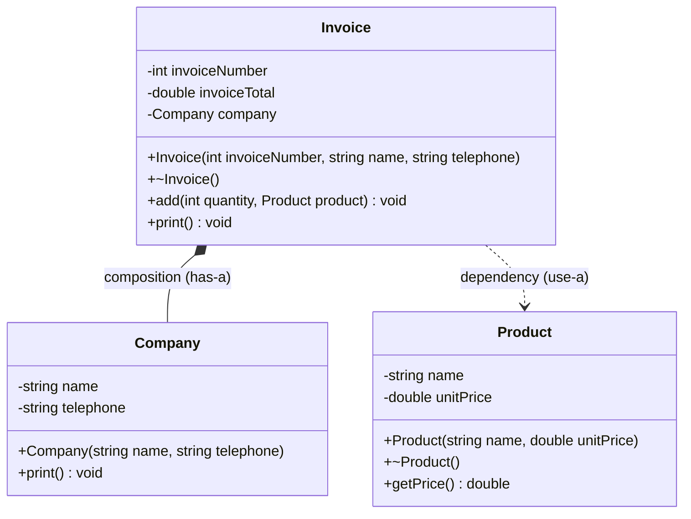

2025 2nd Semester, C++ Programming Course - Remote Repository

```mermaid
classDiagram
    class Company {
        -string name
        -string telephone
        +Company(string name, string telephone)
        +print() void
    }

    class Product {
        -string name
        -double unitPrice
        +Product(string name, double unitPrice)
        +~Product()
        +getPrice() double
    }

    class Invoice {
        -int invoiceNumber
        -double invoiceTotal
        -Company company
        +Invoice(int invoiceNumber, string name, string telephone)
        +~Invoice()
        +add(int quantity, Product product) void
        +print() void
    }

    Invoice *-- Company : composition (has-a)
    Invoice ..> Product : dependency (use-a)
```

